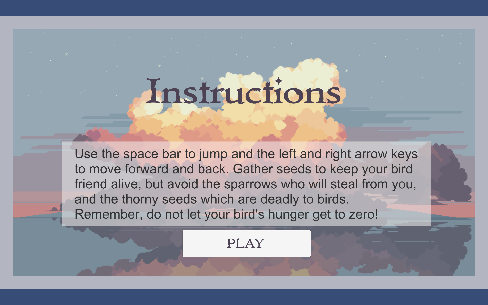
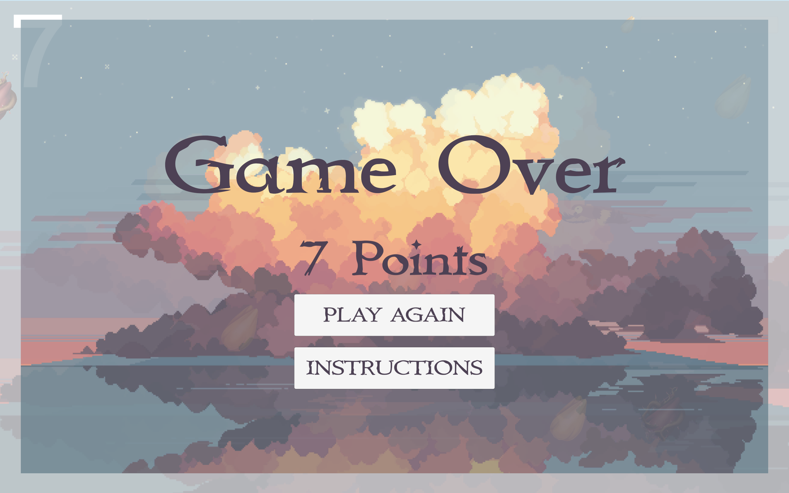

# DontFeedMe
A 2D side-scroller game developed using Unity and C# in Visual Studio. This game implements rigid body dynamics and 2D animation.

# Videos of the Gameplay

#### Below is game play of when loading up the game and beginning to play:
<video src="https://user-images.githubusercontent.com/Gameplay1.mov"></video>

#### Below shows game play of the user touching a deadly obstacle and losing:
<video src="https://user-images.githubusercontent.com/Gameplay2.mov"></video>

#### Below shows how going out of bounds causes user to lose the game: 
<video src="https://user-images.githubusercontent.com/Gameplay3.mov"></video>

# Images of Start, Game Over and Instruction Screen

